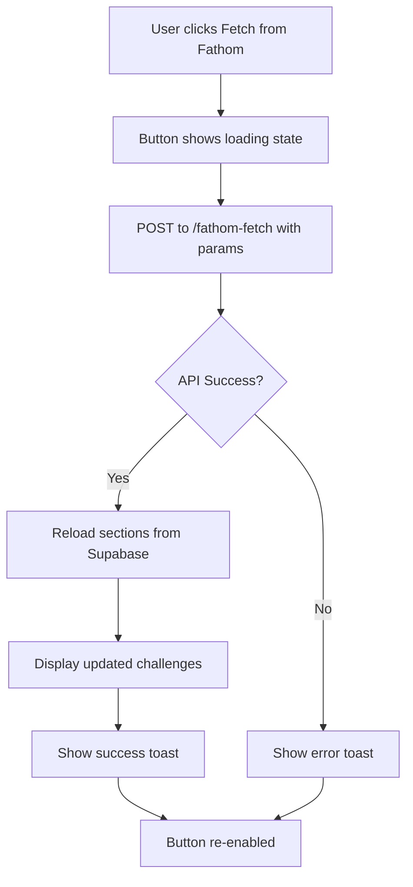

# 🎤 Fathom Fetch Enhancements - Complete Implementation

## ✅ Implementation Summary

Three key enhancements have been successfully implemented:

1. **Collapsible "Fathom Response" Panel** in Proposal Agent Admin
2. **ValuDock® Registered Trademark Symbol**
3. **"Fetch from Fathom" Button** in Challenges & Goals Panel

---

## 🎯 Feature 1: Collapsible Fathom Response Panel

### Location
**Admin → Agent → Agent Runner Tab → Fathom Integration Card**

### What Changed
- Response is now in a **collapsible panel** labeled "Fathom Response"
- Meeting count badge shows number of meetings found
- Chevron icon indicates expand/collapse state
- Panel is **open by default** when results are available

### Visual Design

**Collapsed State**:
```
┌────────────────────────────────────────────────────────┐
│ Fathom Response [5 meetings] ▼                         │
└────────────────────────────────────────────────────────┘
```

**Expanded State**:
```
┌────────────────────────────────────────────────────────┐
│ Fathom Response [5 meetings] ▲                         │
├────────────────────────────────────────────────────────┤
│ {                                                      │
│   "success": true,                                     │
│   "meetings": [...],                                   │
│   "count": 5                                           │
│ }                                                      │
└────────────────────────────────────────────────────────┘
```

### Implementation Details

**File**: `/components/ProposalAgentRunner.tsx`

**Component Structure**:
```tsx
{fathomTestResult && (
  <Collapsible defaultOpen={true}>
    <div className="flex items-center justify-between">
      <CollapsibleTrigger asChild>
        <Button variant="ghost" size="sm" className="w-full justify-between p-2">
          <div className="flex items-center gap-2">
            <Label className="text-sm font-medium cursor-pointer">Fathom Response</Label>
            {fathomTestResult.meetings && Array.isArray(fathomTestResult.meetings) && (
              <Badge variant="secondary">
                {fathomTestResult.meetings.length} meeting{fathomTestResult.meetings.length !== 1 ? 's' : ''}
              </Badge>
            )}
          </div>
          <ChevronDown className="h-4 w-4" />
        </Button>
      </CollapsibleTrigger>
    </div>
    <CollapsibleContent className="space-y-2 pt-2">
      <ScrollArea className="h-64 w-full rounded-md border p-4">
        <pre className="text-xs">
          {JSON.stringify(fathomTestResult, null, 2)}
        </pre>
      </ScrollArea>
    </CollapsibleContent>
  </Collapsible>
)}
```

---

## 🎯 Feature 2: ValuDock® Trademark Symbol

### Location
**Main header across all screens**

### What Changed
- "ValuDock" now displays as **"ValuDock®"**
- Registered trademark symbol (®) appears in **superscript**
- Small, unobtrusive styling

### Visual Design

**Before**:
```
┌─────────────────────────────────┐
│ 🏢 ValuDock                      │
│    Welcome John                 │
└─────────────────────────────────┘
```

**After**:
```
┌─────────────────────────────────┐
│ 🏢 ValuDock®                     │
│    Welcome John                 │
└─────────────────────────────────┘
```

### Implementation Details

**File**: `/App.tsx`

**Code Change**:
```tsx
<h1 className="text-xl md:text-3xl font-bold truncate">
  ValuDock<sup className="text-xs">®</sup>
</h1>
```

**Styling**:
- `<sup>` element for superscript positioning
- `text-xs` for smaller font size
- Maintains responsive design (scales with h1)

---

## 🎯 Feature 3: "Fetch from Fathom" Button in Challenges & Goals

### Location
**Admin → Proposal Agent → Edit Content → Challenges & Goals Tab**

### What Changed
- New **"Fetch from Fathom"** button added to section header
- Button appears **only in Challenges & Goals section**
- Fetches meeting data and updates content from Supabase
- Loading state with spinner during fetch
- Auto-refreshes panel after successful fetch

### Visual Design

**Button States**:

**Idle**:
```
[🎤 Fetch from Fathom] [Reset]
```

**Loading**:
```
[⟳ Fetching...] [Reset (disabled)]
```

**Success** (auto-refreshes content):
```
Toast: "Challenges updated from Fathom meetings!"
```

### Implementation Details

**File**: `/components/ProposalContentBuilder.tsx`

#### 1. State Management
```typescript
const [isFetchingFromFathom, setIsFetchingFromFathom] = useState(false);
```

#### 2. Handler Function
```typescript
const handleFetchFromFathom = async () => {
  try {
    setIsFetchingFromFathom(true);
    toast.info('Fetching challenges from Fathom meetings...');
    
    // Calculate date range (last 30 days by default)
    const endDate = new Date();
    const startDate = new Date();
    startDate.setDate(startDate.getDate() - 30);
    
    const payload = {
      tenant_id: tenantId,
      org_id: organizationId,
      deal_id: dealId,
      start: startDate.toISOString().split('T')[0],
      end: endDate.toISOString().split('T')[0],
      tags: '' // Optional: could add tag filter
    };
    
    const response = await apiCall('/fathom-fetch', {
      method: 'POST',
      body: payload
    });
    
    if (response.success) {
      // Reload sections to get updated challenges from Supabase
      await loadSections();
      toast.success('Challenges updated from Fathom meetings!');
    } else {
      toast.error('Failed to fetch from Fathom: ' + (response.error || 'Unknown error'));
    }
  } catch (error: any) {
    console.error('Error fetching from Fathom:', error);
    toast.error('Failed to fetch from Fathom');
  } finally {
    setIsFetchingFromFathom(false);
  }
};
```

#### 3. UI Integration
```tsx
<div className="flex gap-2">
  {/* Fetch from Fathom button - Only for Challenges section */}
  {config.id === 'challenges' && (
    <Button
      variant="default"
      size="sm"
      onClick={handleFetchFromFathom}
      disabled={isFetchingFromFathom}
    >
      {isFetchingFromFathom ? (
        <>
          <Loader2 className="h-4 w-4 mr-2 animate-spin" />
          Fetching...
        </>
      ) : (
        <>
          <Mic className="h-4 w-4 mr-2" />
          Fetch from Fathom
        </>
      )}
    </Button>
  )}
  <Button
    variant="outline"
    size="sm"
    onClick={() => handleResetSection(config.id)}
  >
    <RotateCcw className="h-4 w-4 mr-2" />
    Reset
  </Button>
</div>
```

### API Request Format

**Endpoint**: `POST /functions/v1/fathom-fetch`

**Payload**:
```json
{
  "tenant_id": "tenant-uuid",
  "org_id": "org-uuid",
  "deal_id": "DEAL-2025-001",
  "start": "2025-09-16",
  "end": "2025-10-16",
  "tags": ""
}
```

**Expected Response**:
```json
{
  "success": true,
  "meetings": [
    {
      "id": "meeting-123",
      "title": "Discovery Call - Acme Corp",
      "transcript": "...",
      "challenges": ["Manual processes", "High error rates"],
      "goals": ["Reduce costs by 30%", "Improve accuracy"]
    }
  ],
  "count": 1
}
```

### Workflow



### Date Range Logic
- **Default**: Last 30 days
- **Start Date**: Today minus 30 days (YYYY-MM-DD format)
- **End Date**: Today (YYYY-MM-DD format)
- **Future Enhancement**: Could add date pickers to customize range

---

## 📊 Complete Feature Comparison

| Feature | Before | After |
|---------|--------|-------|
| **Fathom Response** | Always visible in scroll area | Collapsible panel with badge |
| **ValuDock Branding** | ValuDock | ValuDock® |
| **Challenges Fetch** | Manual editing only | Fetch from Fathom + Manual editing |

---

## 🧪 Testing Checklist

### Test 1: Collapsible Fathom Response
- [ ] Navigate to Admin → Agent → Agent Runner
- [ ] Fill date range and click Test Fetch
- [ ] Verify "Fathom Response" label appears
- [ ] Verify meeting count badge shows
- [ ] Click to collapse panel
- [ ] Click to expand panel
- [ ] Verify chevron icon rotates

### Test 2: Trademark Symbol
- [ ] Check main header on all screens
- [ ] Verify "ValuDock®" displays correctly
- [ ] Check superscript is small and unobtrusive
- [ ] Test on mobile (symbol should scale)
- [ ] Verify no layout shift

### Test 3: Fetch from Fathom Button
- [ ] Navigate to Admin → Proposal Agent
- [ ] Click "Edit Content" on a proposal
- [ ] Go to "Challenges & Goals" tab
- [ ] Verify button shows "Fetch from Fathom"
- [ ] Click button
- [ ] Verify loading state shows spinner
- [ ] Verify success toast appears
- [ ] Verify content refreshes
- [ ] Check other tabs don't show button

---

## 🎨 Visual States Reference

### Fathom Response Panel States

**State 1: No Results Yet**
```
(Panel not visible)
```

**State 2: Results Loaded (Expanded)**
```
┌────────────────────────────────────┐
│ Fathom Response [3 meetings] ▲    │
├────────────────────────────────────┤
│ {                                  │
│   "success": true,                 │
│   "meetings": [...]                │
│ }                                  │
└────────────────────────────────────┘
```

**State 3: Results Loaded (Collapsed)**
```
┌────────────────────────────────────┐
│ Fathom Response [3 meetings] ▼    │
└────────────────────────────────────┘
```

### Fetch from Fathom Button States

**State 1: Ready**
```
[🎤 Fetch from Fathom] [Reset]
```

**State 2: Loading**
```
[⟳ Fetching...] [Reset]
(both buttons disabled)
```

**State 3: Success**
```
[🎤 Fetch from Fathom] [Reset]
(re-enabled, content refreshed)
Toast: "Challenges updated from Fathom meetings!"
```

**State 4: Error**
```
[🎤 Fetch from Fathom] [Reset]
(re-enabled, content unchanged)
Toast: "Failed to fetch from Fathom: [error message]"
```

---

## 🔧 Backend Requirements

### Endpoint to Implement

**Route**: `POST /functions/v1/fathom-fetch`

**Handler Logic**:
1. Receive payload with tenant_id, org_id, deal_id, start, end, tags
2. Fetch meetings from Fathom API for date range
3. Filter by tags if provided
4. Extract challenges and goals from transcripts (using AI)
5. Save to Supabase under challenges section for this deal/version
6. Return success response

**Minimal Implementation**:
```typescript
app.post('/fathom-fetch', async (c) => {
  const { tenant_id, org_id, deal_id, start, end, tags } = await c.req.json();
  
  // Fetch from Fathom
  const meetings = await fetchFathomMeetings(start, end, tags);
  
  // Extract challenges using AI
  const challenges = await extractChallenges(meetings);
  
  // Save to Supabase
  await saveChallenges(deal_id, org_id, challenges);
  
  return c.json({
    success: true,
    meetings: meetings,
    count: meetings.length
  });
});
```

---

## 📚 Related Documentation

- **[FATHOM_INTEGRATION_CARD.md](FATHOM_INTEGRATION_CARD.md)** - Fathom integration overview
- **[FATHOM_CARD_QUICK_START.md](FATHOM_CARD_QUICK_START.md)** - Quick start guide
- **[PROPOSAL_CONTENT_BUILDER_GUIDE.md](PROPOSAL_CONTENT_BUILDER_GUIDE.md)** - Content builder overview
- **[FATHOM_WEBHOOK_IMPLEMENTATION.md](FATHOM_WEBHOOK_IMPLEMENTATION.md)** - Webhook setup

---

## 🚀 Usage Guide

### For Users

#### Using Collapsible Fathom Response
1. Go to Admin → Agent → Agent Runner
2. Fill in start/end dates
3. Click "Test Fetch"
4. View response in collapsible panel
5. Click panel header to collapse/expand
6. Badge shows meeting count

#### Viewing ValuDock® Trademark
- Look for "ValuDock®" in main header
- Appears on all screens
- No action required

#### Fetching Challenges from Fathom
1. Go to Admin → Proposal Agent
2. Click "Edit Content" on a proposal
3. Navigate to "Challenges & Goals" tab
4. Click "Fetch from Fathom" button
5. Wait for loading (shows spinner)
6. Content auto-refreshes with updated challenges
7. Success toast confirms completion

### For Developers

#### Extending Fathom Fetch
```typescript
// Add custom date range
const handleFetchFromFathom = async (startDate: string, endDate: string) => {
  const payload = {
    tenant_id: tenantId,
    org_id: organizationId,
    deal_id: dealId,
    start: startDate,
    end: endDate,
    tags: customTags
  };
  // ... rest of implementation
};
```

#### Customizing Response Panel
```tsx
// Add custom badges or metadata
<Badge variant="secondary">
  {fathomTestResult.meetings.length} meetings
</Badge>
<Badge variant="outline">
  {fathomTestResult.date_range}
</Badge>
```

---

## ✅ Implementation Checklist

### Frontend Changes
- [x] Add Collapsible component to Fathom test results
- [x] Add meeting count badge
- [x] Add chevron icon for expand/collapse
- [x] Add trademark symbol to ValuDock header
- [x] Add "Fetch from Fathom" button to Challenges section
- [x] Add loading state for fetch button
- [x] Add handler function with API call
- [x] Add auto-refresh after successful fetch
- [x] Add toast notifications
- [x] Import Mic icon

### Backend Requirements (Pending)
- [ ] Implement `/fathom-fetch` endpoint
- [ ] Add Fathom API integration
- [ ] Add AI-powered challenge extraction
- [ ] Save challenges to Supabase
- [ ] Return success response

---

## 🎯 Key Benefits

### Collapsible Response Panel
✅ **Cleaner UI** - Less screen clutter  
✅ **Better UX** - User controls visibility  
✅ **At-a-glance info** - Meeting count badge  
✅ **Intuitive** - Familiar collapse pattern

### Trademark Symbol
✅ **Professional branding** - Shows registered trademark  
✅ **Legal protection** - Indicates trademark status  
✅ **Subtle design** - Doesn't distract from UI  
✅ **Consistent** - Appears throughout app

### Fetch from Fathom
✅ **Automated content** - Reduces manual work  
✅ **AI-powered** - Extracts relevant challenges  
✅ **Real meeting data** - Based on actual conversations  
✅ **Time saver** - One-click fetch and update  
✅ **Context-aware** - Uses deal/org context

---

**Status**: ✅ Frontend Complete (Backend Integration Pending)  
**Files Modified**: 2 (`App.tsx`, `ProposalContentBuilder.tsx`, `ProposalAgentRunner.tsx`)  
**Lines Added**: ~80 lines total  
**Version**: 1.0  
**Date**: 2025-10-16
